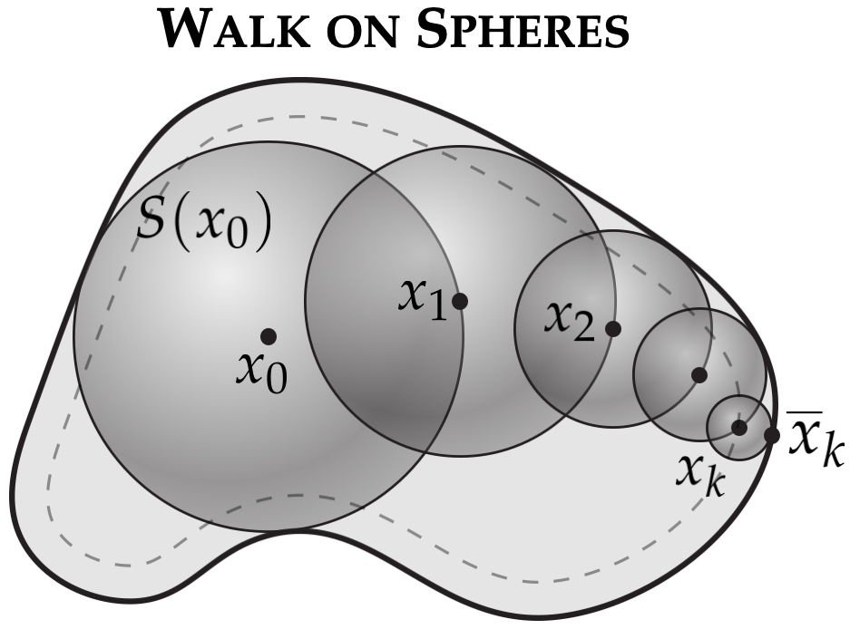
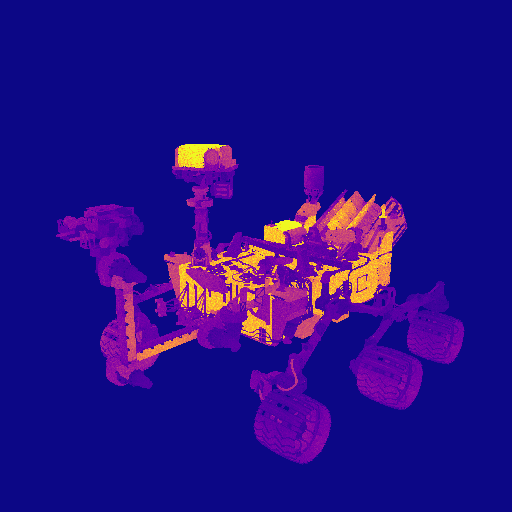
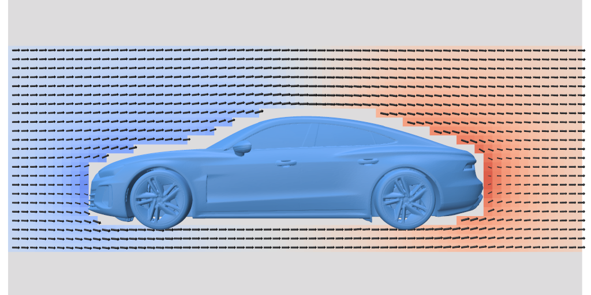

<h1 align="center"><em>Walk on Spheres Extensions (WoSX)</em></h1>



WoSX is a C++17 header-only library, with GPU support and Python
bindings, for solving partial differential equations with
[Walk on Spheres](https://en.wikipedia.org/wiki/Walk-on-spheres_method)-style
Monte Carlo methods. It is designed for problems where creating a volume mesh is
awkward, expensive, or unnecessary: the solver queries the original boundary
representation directly and estimates the solution only where values are needed.

WoSX is forked from [Zombie](https://github.com/rohan-sawhney/zombie), and has
equivalent CPU functionality. This repository builds on that foundation with
GPU support and demo applications that show how the same ideas apply to complex
2D and 3D geometries.

WoSX is research software. The algorithms are still an active area of research,
and the implementations are meant to be clear reference implementations rather
than final word on performance or variance reduction. For a broader introduction
to Walk on Spheres and its recent extensions, see this
[overview talk](https://www.youtube.com/watch?v=cmgNqCwaPYc) and this
[webpage](https://rohan-sawhney.github.io/mcgp-resources/) for in-depth resources
such as recent publications and tutorials.

## Getting Started

The best way to get started is through the demo applications in [`demo_apps/`](demo_apps/):

<div align="center">

<table>
  <tr>
    <th>Thermal Conduction</th>
    <th>Electrostatics</th>
    <th>Potential Flow</th>
  </tr>
  <tr>
    <td align="center"></td>
    <td align="center"></td>
    <td align="center"></td>
  </tr>
</table>

</div>

- [`basic_2d`](demo_apps/basic_2d/): compact 2D reference problems for Laplace,
  Poisson, screened Poisson, and multiple solvers.
- [`thermal_conduction`](demo_apps/thermal_conduction/): thermal
  rendering on a complex Mars rover mesh with textured boundary data.
- [`electrostatics`](demo_apps/electrostatics/): moving comb-drive
  electrostatics with interactive electric potential and field visualization.
- [`potential_flow`](demo_apps/potential_flow/): exterior potential flow around
  complex 3D shapes.
- [`geometric_deformation`](demo_apps/geometric_deformation/): *Coming soon!*

Each demo has its own README with the problem setup, expected outputs, and C++
and Python run commands.

## Core Workflow

Most WoSX applications follow the same high-level workflow:

1. Define geometric queries for the domain boundary, such as distance,
   intersection, and projection queries.
2. Define PDE data: source term, screening, and Dirichlet,
   Neumann, or Robin boundary conditions.
3. Choose sample/evaluation points where the solution and its
   spatial gradient should be estimated.
4. Choose a solver, run the random walks, and write or visualize the resulting values.

The same conceptual workflow applies in C++ and Python, and on CPU and GPU. The
CPU API uses ordinary C++ objects and callbacks. The GPU API packages the same
ideas into GPU task handles, shader resources, and PDE definitions in the
[Slang Shading Language](https://shader-slang.org/).

<p align="center"></p>

## Capabilities

WoSX targets scalar and vector-valued PDEs in 2D and 3D, including Laplace,
Poisson, and screened Poisson equations. Boundary conditions may be mixed
across the same boundary:

- Dirichlet: prescribed solution value.
- Neumann: prescribed normal derivative.
- Robin: linear combination of solution value and normal derivative.

Screened Poisson problems currently use a constant absorption coefficient.
Geometric queries are backed by [FCPW](https://github.com/rohan-sawhney/fcpw),
with line-segment boundaries in 2D and triangle-mesh boundaries in 3D. Exterior
problems can be handled through a [Kelvin transform](https://cseweb.ucsd.edu/~viscomp/projects/SIG21KelvinTransform/).

Available solver families include [Walk on Spheres](https://www.cs.cmu.edu/~kmcrane/Projects/MonteCarloGeometryProcessing/)
for Dirichlet conditions, Walk on Stars for [Neumann](https://www.cs.cmu.edu/~kmcrane/Projects/WalkOnStars/) and
[Robin](https://imaging.cs.cmu.edu/walk_on_stars_robin/) conditions, and
[Boundary Value Caching](http://www.rohansawhney.io/BoundaryValueCaching.pdf) and
[Reverse Walk on Stars](https://cs.dartmouth.edu/~wjarosz/publications/qi22bidirectional.html)
for noise reduction. Reverse Walk on Stars is CPU-only; the other main solvers
are available through the CPU and GPU demos.

GPU support has been extensively tested with CUDA. WoSX uses Slang/RHI through
FCPW, which also provides backend support for Vulkan, Direct3D, and Metal (though
these backends have not been tested with WoSX).

## Building From Source

After cloning the repository, initialize submodules:

```bash
git submodule update --init --recursive
```

Configure and build from the repository root:

```bash
cmake -S . -B build -DWOSX_ENABLE_GPU_SUPPORT=ON -DWOSX_BUILD_DEMO_APPS=ON
cmake --build build -j4
```

Use `-DWOSX_ENABLE_GPU_SUPPORT=OFF` for a CPU-only build. Python bindings can be
enabled in CMake with `-DWOSX_BUILD_BINDINGS=ON`.

## Python Installation

Install the Python package from the project root:

```bash
pip install . --force-reinstall
```

To build the Python bindings with GPU support:

```bash
pip install . --config-settings=cmake.define.WOSX_ENABLE_GPU_SUPPORT=ON --force-reinstall
```

The Python API can be inspected from a Python console:

```python
import wosx
help(wosx)
```

## Dependencies

The core WoSX library depends on the following open source software, included as
submodules:

- FCPW: Fastest Closest Points in the West ([MIT License](https://github.com/rohan-sawhney/fcpw/blob/master/LICENSE))
- nanoflann ([BSD License](https://github.com/jlblancoc/nanoflann?tab=License-1-ov-file))
- oneTBB ([Apache-2.0 License](https://github.com/uxlfoundation/oneTBB/blob/master/LICENSE.txt))
- pcg32 ([Apache-2.0 License](https://github.com/wjakob/pcg32/blob/master/pcg32.h))

The demo applications depend on:

- polyscope ([MIT License](https://github.com/nmwsharp/polyscope/blob/master/LICENSE))
- stb ([MIT License](https://github.com/nothings/stb/blob/master/LICENSE))
- nlohmann/json ([MIT License](https://github.com/nlohmann/json/blob/develop/LICENSE.MIT))

The Python bindings are generated using nanobind ([BSD License](https://github.com/wjakob/nanobind/blob/master/LICENSE)).

## Contributors

[Rohan Sawhney](http://www.rohansawhney.io)

## License

Code is released under the [Apache License, Version 2.0](LICENSE).

## Contributing

Contributions and pull requests from the community are welcome. Rather than requiring a formal Contributor License Agreement (CLA), we use the Developer Certificate of Origin to ensure contributors have the right to submit their contributions to this project. Please ensure that all commits have a [sign-off](https://git-scm.com/docs/git-commit#Documentation/git-commit.txt--s) added with an email address that matches the commit author to agree to the DCO terms for each particular contribution.

The full text of the DCO can be found [here](https://github.com/rohan-sawhney/wosx/blob/main/DCO).

## Citation

```bibtex
@software{WoSX,
author = {Sawhney, Rohan},
title = {Walk on Spheres Extensions (WoSX)},
version = {1.0},
year = {2026}}
```
