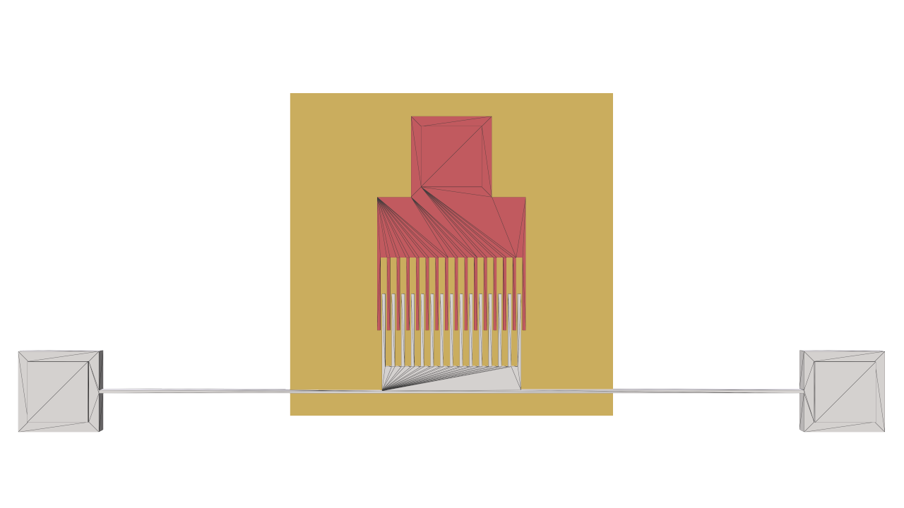

# Electrostatics Demo

This demo solves a 3D electrostatics problem for a MEMS comb-drive actuator.
MEMS, or micro-electromechanical systems, are tiny mechanical devices used in
sensors, switches, mirrors, and other precision components. Here, the electric
potential is estimated in the open space around the comb electrodes as one comb
moves sinusoidally relative to the other.

The setup shows the grounded fixed comb in white, the driven movable comb in
red, and the visualization slice plane in yellow.
<div align="center"></div>

For each frame, the demo estimates the electric potential and electric field
magnitude on the slice plane. The example below shows the 75V case.

<div align="center">

<table>
  <tr>
    <th>Electric potential</th>
    <th>Electric field magnitude</th>
  </tr>
  <tr>
    <td align="center"></td>
    <td align="center"></td>
  </tr>
</table>

</div>

## Technical Details

The demo solves a Laplace equation for the electric potential `phi`, with zero
volume charge density. Dirichlet conditions are applied on the conductor
surfaces: the fixed comb is grounded, and the movable comb is assigned the
configured voltage. A surrounding box provides a homogeneous Neumann boundary,
modeling an insulating truncation of the computational domain.

The conductor mesh is split into connected components to identify the movable
comb. During the animation, that component is displaced along a sinusoidal path,
the GPU geometric queries are updated, and WoSX's GPU walk on stars solver
estimates both `phi` and its spatial gradient at slice-plane sample points. The
electric field magnitude visualization is derived from this gradient.

The main outputs are:

- `Electric Potential`: a face scalar quantity on the slice plane.
- `Electric Field Magnitude`: a face scalar quantity derived from `grad(phi)`.

Relevant settings live in `config.json`: `problem.geometry`,
`problem.movableCombVoltage`, `problem.nFrames`, `problem.sliceResolutionPow2`,
walk settings under `solver`, and output filenames/colormaps under `output`.

## Demo Modes

With `output.visualizeProblem` set to `true`, the demo opens a Polyscope viewer
showing the electrodes, voltage assignment, and slice plane. The GUI exposes a
`Movable Comb Voltage` slider and buttons to start or stop the moving-comb solve.
With `visualizeProblem` set to `false`, the demo runs all frames and writes
frame-indexed colormapped PNGs for the electric potential and field magnitude.

## Running the C++ Demo

Run the executable from the build directory as follows:

```bash
cd build
./demo_apps/electrostatics ../demo_apps/electrostatics/config.json
```

When `visualizeProblem` is `false`, the images are written relative to
`demo_apps/electrostatics/`, for example
`solutions/electric_potential_0000.png` and
`solutions/electric_field_magnitude_0000.png`.

## Running the Python Demo

Run the Python app from the repository root:

```bash
python demo_apps/electrostatics/app.py --config=demo_apps/electrostatics/config.json
```

The Python version mirrors the C++ demo structure and uses the same
`config.json` file.
