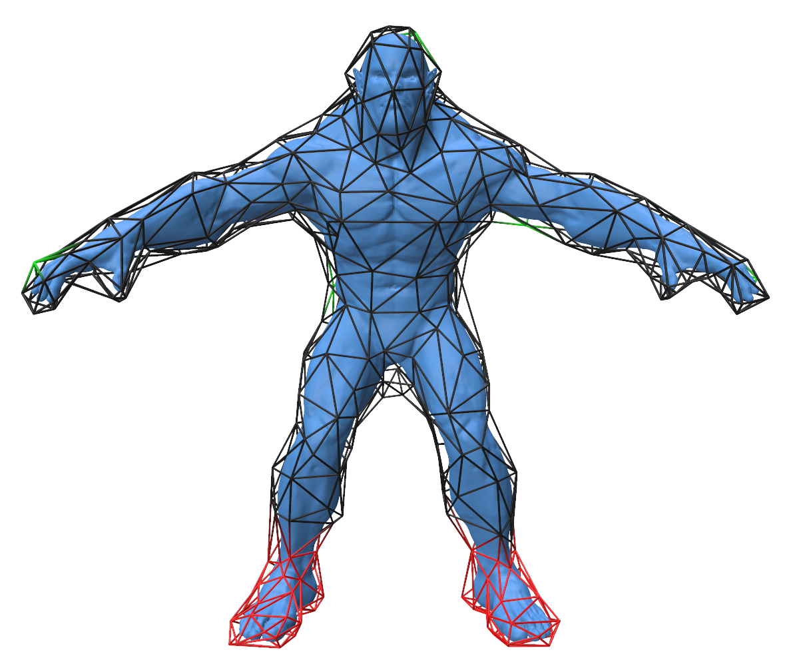
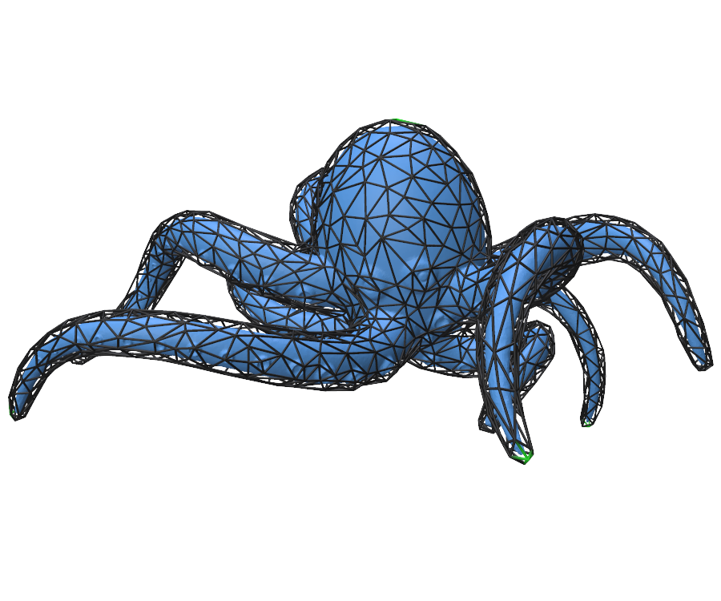

# Geometric Deformation Demo

This demo computes cage-based deformations for detailed triangle meshes without
tetrahedralizing the volume between the model and its cage. It implements the
harmonic-coordinate case of the [Stochastic Barycentric
Coordinates](https://dl.acm.org/doi/10.1145/3658131) method, then uses the
resulting coordinates to transfer interactive cage deformations to the embedded
geometry.

The examples below show two models inside their triangular cages, followed by
the resulting interactive deformations.

<div align="center">

<table>
  <tr>
    <th>Beast</th>
    <th>Octopus</th>
  </tr>
  <tr>
    <td align="center"></td>
    <td align="center"></td>
  </tr>
  <tr>
    <td align="center"></td>
    <td align="center"></td>
  </tr>
</table>

</div>

## Technical Details

The demo is a non-trivial application built on top of WoSX and demonstrates how
an application can define a custom Slang compute shader while reusing library
functionality. Each vertex of the embedded mesh becomes a query point inside a
closed triangular cage. The custom entrypoint in
`harmonic-samples-generation.cs.slang` invokes WoSX's GPU walk-on-spheres
implementation, and records the terminal cage hit point and triangle for
every random walk.

The CPU accumulates these samples into harmonic coordinates using barycentric
coordinates on the hit triangles. Reproducing Kernel Particle Method (RKPM)
correction restores linear precision, and optional cotangent-Laplacian
denoising reduces Monte Carlo noise. The finalized coordinates are stored as a
sparse matrix and can be reused for arbitrary cage deformations.

For interactive editing, the demo provides an as-rigid-as-possible (ARAP) surface
solver to deform the cage from user-selected handle vertices. Precomputed harmonic
coordinates are then used to transfer the cage displacement to the embedded mesh.
Neither coordinate generation nor deformation requires a volumetric mesh of the
cage interior.

Relevant settings live in `config.json`: `problem.embeddedMesh`,
`problem.cageMesh`, the initial ARAP handle count and fixed-vertex threshold,
walk settings under `solver`, and the RKPM and denoising toggles.

## Demo Workflow

Use `Generate Samples` to accumulate one or more batches of boundary samples,
then select `Finalize Coordinates`. The identity and rotation checks visualize
linear precision before deformation. Once coordinates are finalized, click a
black cage vertex to add a handle, click a green handle to make it active, and
drag the translation gizmo to deform the cage. Red cage vertices remain fixed.

## Running the C++ Demo

Run the executable from the build directory as follows:

```bash
cd build
./demo_apps/geometric_deformation ../demo_apps/geometric_deformation/config.json
```

Select the embedded mesh and its matching cage through `problem.embeddedMesh`
and `problem.cageMesh` in `config.json`. The demo always opens a Polyscope
viewer for coordinate generation, validation, and interactive deformation.
