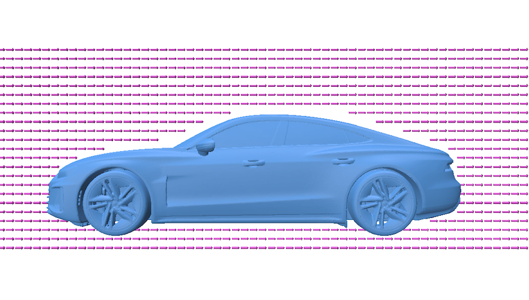
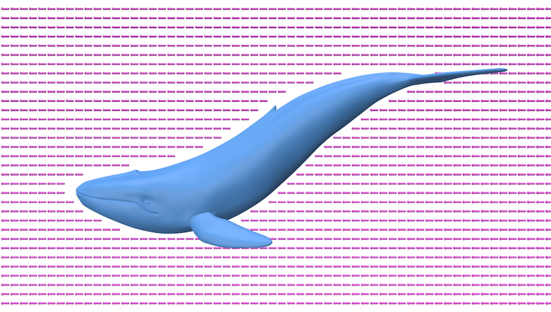
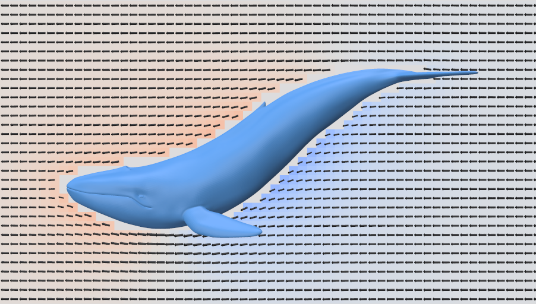

# Potential Flow Demo

This demo solves an exterior potential-flow problem around a closed 3D body
using WoSX, without generating a volume mesh. The flow is evaluated on a slice
plane through the exterior domain, excluding cells that lie inside or too close
to the body.

The examples below show the setup view and solved flow view for two different
input geometries. Each pair is shown side by side: the left image shows the
freestream setup, and the right image shows the resulting perturbation potential
with flow velocity overlaid.

<div align="center">

<table>
  <tr>
    <th>Freestream setup</th>
    <th>Solved flow</th>
  </tr>
  <tr>
    <td></td>
    <td></td>
  </tr>
  <tr>
    <td></td>
    <td></td>
  </tr>
</table>

</div>

## Technical Details

The problem is formulated for a perturbation potential `u` in the unbounded
exterior of the body. A uniform freestream velocity `U` is prescribed at
infinity, and the body surface uses a no-through-flow Neumann condition so the
total velocity `U + grad(u)` is tangent to the surface.

WoSX handles the exterior domain with a Kelvin transform: the mesh and query
points are inverted into a bounded domain, random walks are run on this inverted
problem using the GPU boundary value caching solver, and the estimated solution
and gradient are mapped back to the original exterior domain.

The main outputs are:

- `Perturbation Potential`: a face scalar quantity on the slice plane.
- `Flow Velocity`: a face vector quantity for the total velocity field.

Relevant settings live in `config.json`: `problem.geometry`,
`problem.freestreamSpeed`, `problem.freestreamAngle`, slice crop limits,
boundary value cache parameters under `solver`, and screenshot/colormap options
under `output`.

**NOTE**: Boundary value caching performs well for estimates in the far field,
but its solution and especially gradient estimates can exhibit high noise and
variance close to the body surface. Improving this near-surface behavior remains
an open research challenge.

## Demo Modes

With `output.visualizeSetup` set to `true`, the demo opens a Polyscope viewer
showing the body, active slice plane, and freestream direction; the freestream
speed and angle can be adjusted interactively. With `visualizeSetup` set to
`false`, it runs the GPU solver and saves a Polyscope screenshot to
`output.flowFile`, overlaying the flow velocity vectors on the perturbation
potential.

## Running the C++ Demo

Run the executable from the build directory as follows:

```bash
cd build
./demo_apps/potential_flow ../demo_apps/potential_flow/config.json
```

When `visualizeSetup` is `false`, the screenshot is written relative to
`demo_apps/potential_flow/`, for example `solutions/flow.png`.

## Running the Python Demo

Run the Python app from the repository root:

```bash
python demo_apps/potential_flow/app.py --config=demo_apps/potential_flow/config.json
```

The Python version mirrors the C++ demo structure and uses the same
`config.json` file.
